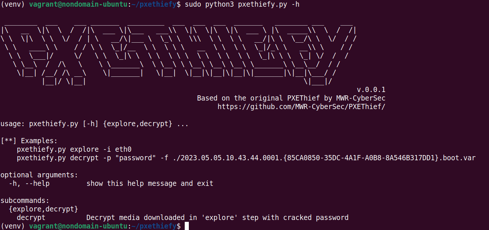
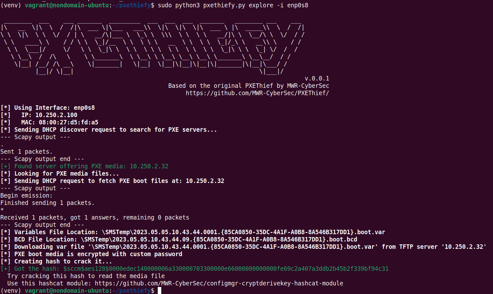
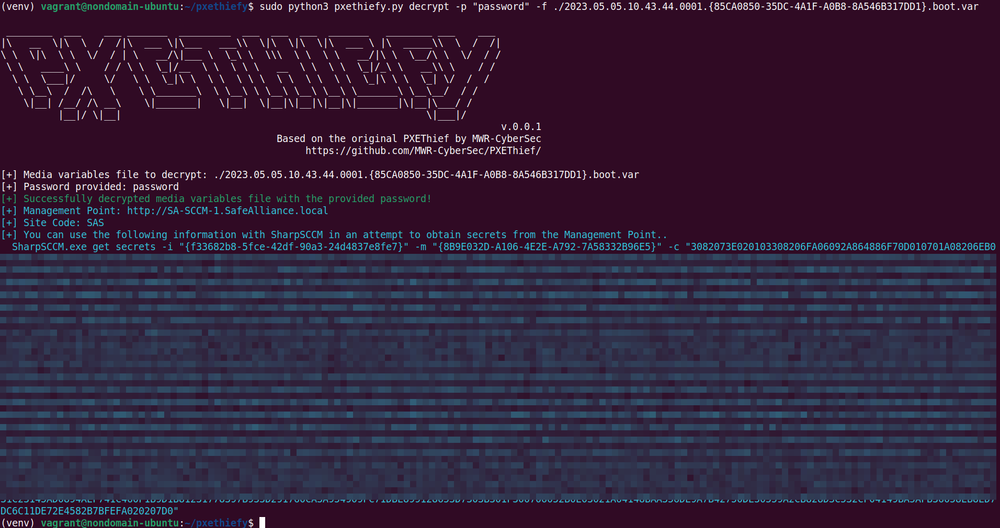

# pxethiefy.py

pxethiefy is a tool to enumerate PXE boot media provided from an SCCM server in a target network by broadcasting for PXE servers, requesting offered boot media and trying to decrypt it.  

This tool is heavily based on the tool [PXEThief](https://github.com/MWR-CyberSec/PXEThief).
While [PXEThief](https://github.com/MWR-CyberSec/PXEThief) is a Windows-based tool (and provides more features), `pxethiefy.py` has a limited feature set, but can be used from Linux hosts as well.
**Shoutout and all credits go to [MWR-CyberSec](https://github.com/MWR-CyberSec/)**.

This tool is a byproduct of SCCM research, which can be found in this blog: [https://www.securesystems.de/blog/active-directory-spotlight-attacking-the-microsoft-configuration-manager/](https://www.securesystems.de/blog/active-directory-spotlight-attacking-the-microsoft-configuration-manager/)

## Install 

#### Using virtualenv
```sh
$:> virtualenv -p python3 venv
$:> source venv/bin/activate
## We need to send and receive raw packets, which usually requires sudo permissions, therefore you got two options here
## Either install and run as sudo
$:> sudo venv/bin/python3 -m pip install -r requirements.txt 
$:> sudo venv/bin/python3 pxethiefy.py -h

## OR install as normal user as follows
$:> python3 -m pip install -r requirements.txt
$:> sudo setcap CAP_NET_RAW=+eip /usr/bin/python3.8 ## change with your python3 version --> run ls -lah /usr/bin/python3* to check symlinks
$:> python3 pxethiefy.py -h
```

#### Using pipx

Install pipx as per installation instructions: [https://pipx.pypa.io/stable/how-to/install-pipx/](https://pipx.pypa.io/stable/how-to/install-pipx/)
Make sure that pipx is in your PATH:
```sh
$:> pipx ensurepath
## Now restart your terminal or do "source ~/.bashrc" (or the equivalent for your shell) to update the PATH variable
```

Then install `pxethiefy` using pipx:
```sh
$:> pipx install git+https://github.com/csandker/pxethiefy
$:> sudo ln -s ~/.local/bin/pxethiefy /usr/local/sbin/pxethiefy

## You can now run pxethiefy as follows
$:> sudo pxethiefy -h
```


## Usage



Sample from an SCCM lab with encrypted PXE boot media:



In case the PXE boot media is encrypted, [this](https://github.com/MWR-CyberSec/configmgr-cryptderivekey-hashcat-module) hashcat module - once again by [MWR-CyberSec](https://github.com/MWR-CyberSec/) - can be used to decrypt the downloaded media file.

Once the password has been cracked, `pxethiefy.py` can be used to read the media file and show potential next steps:


